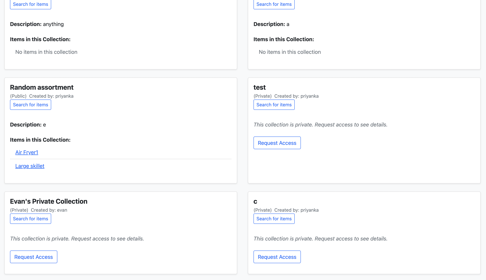

# KitchenShare

KitchenShare is a Django-based CLA (Cataloging and Lending App) that helps people share kitchen ingredients and tools with neighbors. Librarians can post available items, create private/public collections, message with Patrons, and approve/deny requests. Patrons can submit borrow requests for items, browse the library, and browse/create collections of items. KitchenShare helps reduce food-related waste, limit overconsumption, and build community. 

I served as the Scrum Master for this Agile team of 5 total developers. This project was created entirely for UVA's Software Engineering course (CS 3240). KitchenShare is for educational use and not intended for commercial deployment. 

## Features

- User authentication and registration through Google
- Librarians can create, browse, edit, and delete listings
- Librarians can create, browse, edit, and delete public/private collections of items
- Patrons can submit requests to borrow items, approved/denied by Librarians
- Patrons can create, browse, and edit public collections of items
- Patrons can see their current borrowings, upcoming due dates, and borrowing history
- Patrons may message Librarians and vice versa
- Both user types can search for items by keyword/filters

## My Role
- As Scrum Master, managed 2-week sprints, including weekly stand-ups, Jira task board, and sprint reports
- Facilitated team communication and teammwork, for a collaborative project much larger than any prior class assignments we had ever worked on, using a framework we were entirely unfamiliar with
- Developed the "home" page and associated logic, where Librarians/Patrons see all available items in the library and can submit borrow requests
- Managed BorrowRequest and ItemRequest models to handle all borrow/approval interactions 


## Tech Stack

- Python & Django
- PostgreSQL
- HTML/CSS + Bootstrap
- Deployed on Heroku (for class purposes only, no longer able to have the site deployed unfortunately)
- Email integration via Gmail 

## Images





## Instructions to Run Project

### 1. Clone the repo

```bash
git clone https://github.com/yourusername/kitchenshare.git
cd kitchenshare
```

### 2. Set up virtual environment
On Mac:
```
python -m venv venv
source venv/bin/activate 
pip install -r requirements.txt
```

On Windows:
```
python -m venv venv
venv\Scripts\activate
pip install -r requirements.txt
```

### 3. Set up variables
cp .env.example .env
Then, open that .env file and add your own credentials for each variable.

### 4. Run migrations
```
python manage.py migrate
```
### 5. Run server
```
python manage.py runserver
```


